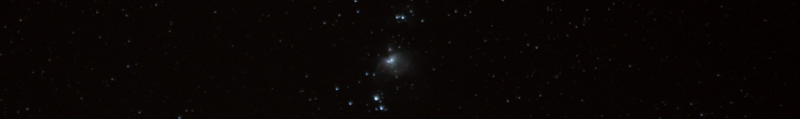

  
# Hi! Welcome to my Github page :)

  
 <!--   -->

### What I do:
- Currently studying Social Science at the JLU Gießen

- I like boardgames, stargazing and acquireing new IT-/statistical skills

-------

### What I use:
  ![Markdown]
(https://img.shields.io/badge/markdown-%23000000.svg?style=for-the-badge&logo=markdown&logoColor=white)  ![R]
(https://img.shields.io/badge/r-%23276DC3.svg?style=for-the-badge&logo=r&logoColor=white)    

-------

### You can find me here:
    
